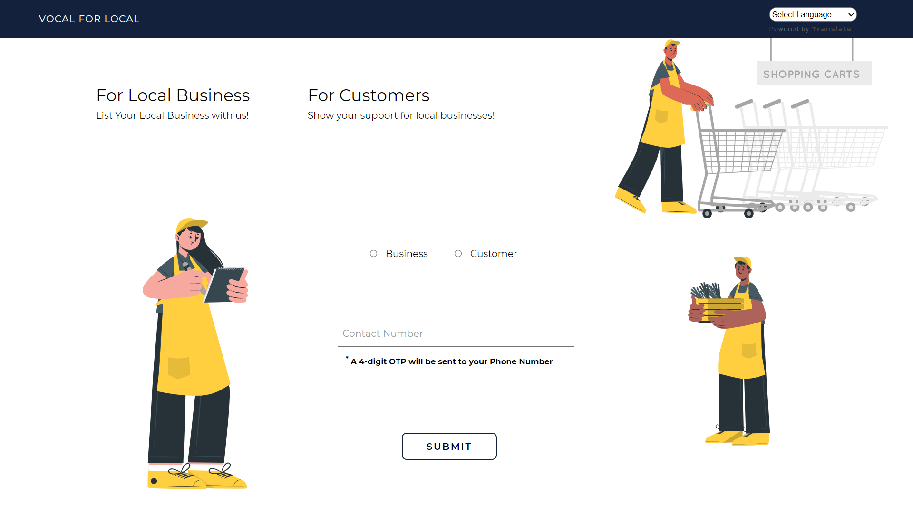
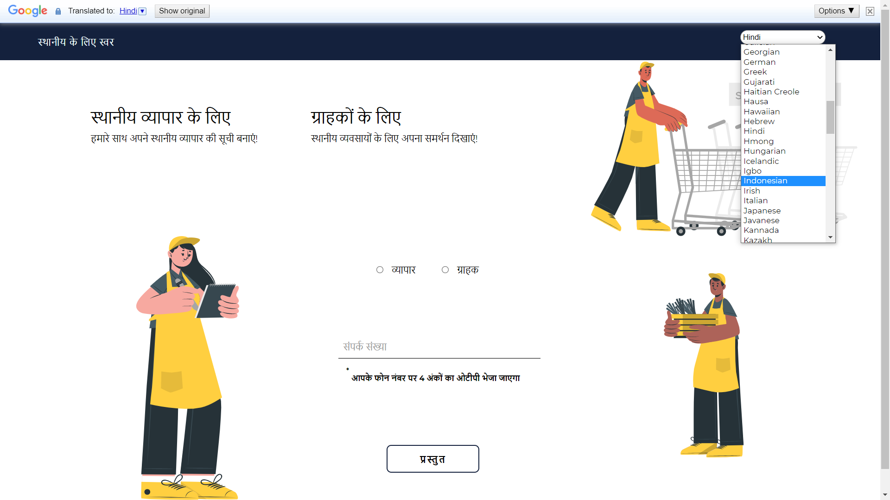
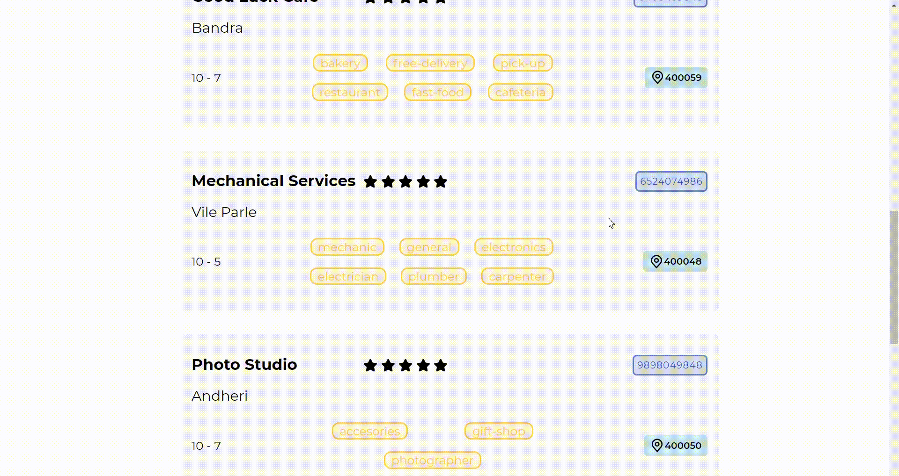
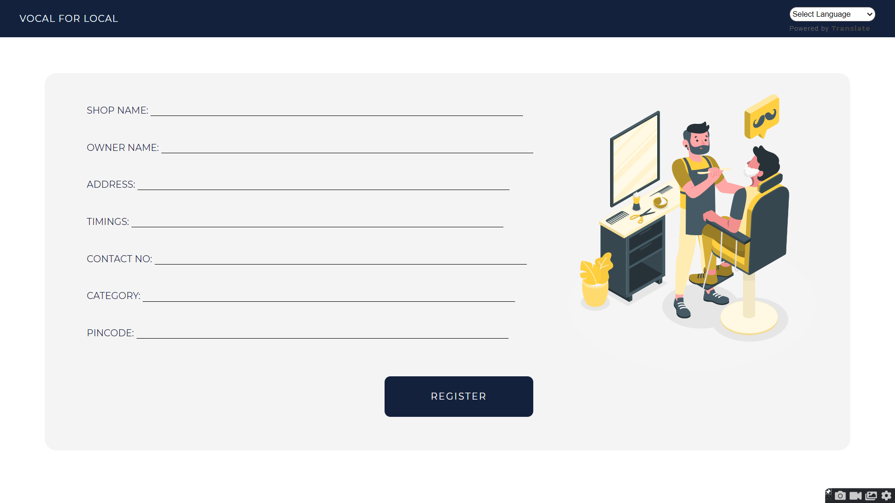
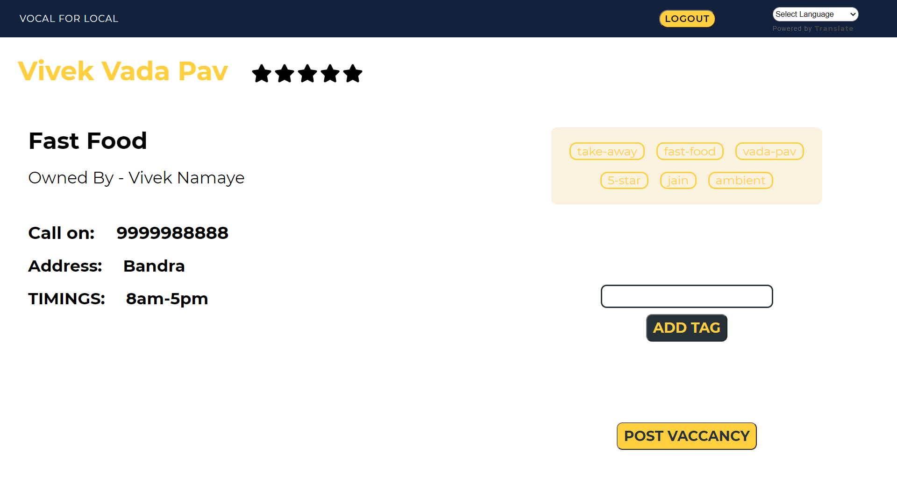

# Vocal For Local

Supporting your neighborhood and the local communities around.

<!--  -->

### Table of Contents

-   [Introduction](#introduction)
-   [Design](/docs/)
-   [Demonstration](#demonstration)
-   [Features](#features)
-   [Technologies Used](#features)
-   [Local Setup](#local-setup)
-   [Authors](#authors)

### Introduction

Vocal For Local - a local product that can be used globally, to support communities all around.



## Demonstration

- Multiple Language Supported



#### Customer Dashboard



#### Seller Register



#### Seller Dashboard

 - Clean and simple UI
 - 


### Features

-   A simple phone number - OTP login. It checks if the number is registered before or not and redirects to respective business registration page or business portal, and if it is a customer, then to the common page.
-   It provides a list of all the shops and services around the customer, altered according to the location of the user.
-   The user can search the product, service, or a specific shop, and the list will be altered according to the location of user.
-   The user has access to the shop's number, timings, ratings, delivery/take-away, and the distance.
-   Now, a peculiar thing about this is that, we needed a simple User Experience from both ends, therefore we chose not implement any payment gateway system, everything is flexible according to the local needs. Moreover listing down each and every product (and the expiry, price, etc.) can be tiresome for the local community, also then it would simply become E-commerce.

Since, this is a local product which alters according to the user's needs, it can be used globally, to support local communities around the world as it also has all languages supported around the world.

### Tech Stack

For Frontend

-   HTML/CSS
-   JavaScript

For Backend

-   Django

### Local Setup

- Read [CODE OF CONDUCT](CODE_OF_CONDUCT.md) check [CONTRIBUTING.md](/CONTRIBUTING.md) for contributions.

```bash
git clone https://github.com/tusharnankani/VocalForLocal.git
git checkout -b <branch-name>
```

```python
python manage.py migrate
python manage.py makemigrations
python manage.py runserver
```

-   Go to `http://127.0.0.1:8000/`

```bash
git add .
git commit -m "message"
git push origin <branch-name>
```

### License 📜

- [MIT License](/LICENSE)

## _Authors_

Meet the team.

- Parinda Pranami
  - [LinkedIn](https://www.linkedin.com/in/parinda-pranami-13943b1aa/) | [Twitter](https://twitter.com/parindda_)

- Rishika Lulla
  - [LinkedIn](https://www.linkedin.com/in/rishika-lulla-48109b1b1)

- Tushar Nankani
  - [LinkedIn](https://www.linkedin.com/in/tusharnankani/) | [Twitter](https://twitter.com/tusharnankanii)

- Vivek Namaye
  - [LinkedIn](https://www.linkedin.com/in/viveknamaye/)
